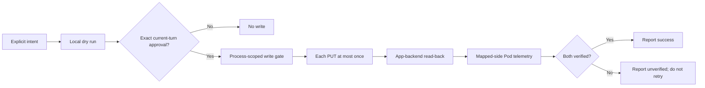

<div align="center">

# 🌙 Manage Eight Sleep

**A safer, verifiable, and shareable Eight Sleep skill for Codex and Hermes**


[](LICENSE)

[English](README.md) · [简体中文](README.zh-CN.md) · [Security](SECURITY.md) · [Privacy](PRIVACY.md)

</div>

> [!IMPORTANT]
> This is an unofficial community project. It is not affiliated with, endorsed by, or supported by Eight Sleep, Inc. It uses an undocumented mobile-app API that may change without notice. Use it only with an account you personally control and equipment you own or are authorized to operate. Authorization to use a device never authorizes sharing another person's password, token, or setup files.

Manage Eight Sleep is a **read-first** skill package for sleep summaries and tightly gated Pod temperature control. Its bundled CLI has no third-party runtime npm dependencies. Initial authentication is delegated to a separate, pinned community utility.

> [!NOTE]
> The project verifies the **App-facing backend**, not the phone screen. `app_ui_observed` is always `false`. If the phone UI looks stale after backend and hardware verification pass, refresh the App—do not repeat a write just to refresh the screen.

## Design goals

This project addresses failure modes observed in real agent-driven Eight Sleep use. It does not claim that a private API can be made permanently stable.

| Failure mode | Project behavior |
|---|---|
| API acknowledges a write, but state does not apply | Require fresh App-backend read-back and mapped-side hardware telemetry |
| App state and hardware telemetry disagree | Report them independently; success requires both |
| Relative levels are described as degrees | Use only App levels `-10` through `+10`; never label them °C or °F |
| App level `0` is treated as off | Treat `0` as neutral smart control; strict off has separate checks |
| A timeout causes duplicate writes | Never automatically retry PUT; use read-only verification after an unknown outcome |
| Hermes loads multiple legacy control paths | Detect conflicts and archive old skills outside active discovery |
| A flag is misspelled or duration is omitted | Fail before credential access or networking; there is no default write duration |
| Trends sends mutually exclusive selectors together | Send exactly one of `main` or `all` |



## Verification scope

| Evidence | What it supports | What it does not prove |
|---|---|---|
| `app_state_verified` | A fresh private mobile-backend read matches the requested state, target, and timed override | The phone screen refreshed or was observed |
| `hardware_verified` | For a nonzero setting, mapped-side actual/current telemetry moves in the requested direction, any reported target matches exactly, and an activity flag is not explicitly false. For off/zero, the side reports a verified zero actual signal or both an exact zero target and inactive state | Physical comfort, surface temperature, or a medical outcome |
| `app_ui_observed` | Always `false` | The project does not inspect the phone UI |

Complete success requires:

```text
ok = true
verification.app_state_verified = true
verification.hardware_verified = true
```

`accepted_by_api` is retained only as a compatibility alias for `app_state_verified`; it never means “the PUT returned 200.”

## Features and boundaries

| Supported | Not supported |
|---|---|
| Primary sleep trends, scores, stages, and efficiency | Diagnosis, treatment, emergency monitoring, or clinical decisions |
| Optional naps and secondary sessions | Raw health-data dumping by default |
| Current Pod temperature state | Phone-screen automation |
| Bounded temporary App-level overrides | Persistent overrides or schedule mutations |
| Strict off and read-only off verification | Alarm, base, away-mode, or account mutations |
| Hermes conflict and configuration-risk audit | Multi-Pod selection |

## Quick start

### Requirements

- macOS or Linux
- Node.js 22 or newer; CI covers Node.js 22, 24, and 26
- An Eight Sleep account personally controlled by the person running the skill
- Codex, Hermes, or both

### 1. Install

```bash
git clone https://github.com/w2478328197-arch/eight-sleep-reliable-skill.git
cd eight-sleep-reliable-skill
chmod +x install.sh
```

Choose one target:

```bash
./install.sh codex
./install.sh hermes
./install.sh both
```

Default destinations:

| Host | Directory |
|---|---|
| Codex | `${CODEX_HOME:-$HOME/.codex}/skills/manage-eight-sleep` |
| Hermes | `${HERMES_HOME:-$HOME/.hermes}/skills/manage-eight-sleep` |

Existing installations are not overwritten by default. Use `--force` only after reviewing both copies:

```bash
./install.sh codex --force
./install.sh both --force
```

If Hermes finds a known legacy Eight Sleep skill, installation stops. After reviewing the paths, let the installer move them into a timestamped, reversible backup outside the skill discovery tree under `${HERMES_HOME:-$HOME/.hermes}/backups/manage-eight-sleep/`:

```bash
./install.sh hermes --backup-conflicts
```

The installer never edits `~/.hermes/config.yaml`. Restart the host or begin a new session after installation.

### 2. Authenticate locally

Each user must let the [pinned third-party utility release](https://www.npmjs.com/package/eight-sleep-mcp-unofficial/v/0.2.5) generate a token on their own computer with an account they personally control:

```bash
npx -y eight-sleep-mcp-unofficial@0.2.5 setup \
  --client generic --privacy-mode summary

chmod 600 ~/.eight-sleep-mcp/config.json \
  ~/.eight-sleep-mcp/tokens.json
```

Choose **No** when that utility asks whether to enable its own write tools. `--client generic` avoids editing Codex/Hermes configuration or installing another Hermes skill. Review the [pinned package](https://www.npmjs.com/package/eight-sleep-mcp-unofficial/v/0.2.5) and its [source repository](https://github.com/davidmosiah/eight-sleep-mcp) before use.

The third-party setup utility separately handles and may store account credentials in its own local configuration. By default, this project's bundled CLI authenticates from `~/.eight-sleep-mcp/tokens.json`; `EIGHT_SLEEP_TOKEN_PATH` can select another token file. If either `EIGHT_SLEEP_ACCESS_TOKEN` or `EIGHT_SLEEP_USER_ID` is present, both are required and that environment pair takes precedence over any token file. Authentication never uses an email or password, and the CLI never modifies token files. The optional Hermes audit scans skill paths plus risk markers in `${HERMES_HOME:-$HOME/.hermes}/config.yaml` and `${HERMES_HOME:-$HOME/.hermes}/.env` locally. It returns no configuration values and does not persist or send the scanned contents.

Treat both local files as secrets. Never paste configuration, tokens, raw API responses, or real sleep data into chats, issues, screenshots, or public logs.

### 3. Check readiness

Choose one skill path for the current shell. These forms respect a custom `CODEX_HOME` or `HERMES_HOME`; if you installed elsewhere, point `SKILL_DIR` at that actual skill directory.

```bash
# Codex (default)
SKILL_DIR="${CODEX_HOME:-$HOME/.codex}/skills/manage-eight-sleep"

# Hermes: use this line instead
# SKILL_DIR="${HERMES_HOME:-$HOME/.hermes}/skills/manage-eight-sleep"
```

```bash
# Codex: offline credential and permission check
node "$SKILL_DIR/scripts/eight-sleep.mjs" \
  doctor --json

# Optional read-only API connectivity check
node "$SKILL_DIR/scripts/eight-sleep.mjs" \
  doctor --check-api --json

# Hermes: include legacy-control-path and config-risk audit
node "$SKILL_DIR/scripts/eight-sleep.mjs" \
  doctor --check-hermes --json
```

Treat the installation as ready only when the top-level result has `ok: true` and `credentials.ready: true`. When the credential source is a token file on macOS or Linux, `credentials.secure_permissions` must also be `true`; `doctor` fails closed if the file is readable by group or other local users.

Recover expired authentication according to its source:

- **Default token file:** refresh `~/.eight-sleep-mcp/tokens.json` with:

```bash
npx -y eight-sleep-mcp-unofficial@0.2.5 login
```

- **Custom token file:** pass the same path to the pinned login utility so it does not refresh only the default file:

```bash
EIGHT_SLEEP_TOKEN_PATH="/absolute/path/to/tokens.json" \
  npx -y eight-sleep-mcp-unofficial@0.2.5 login
```

- **Single-process environment pair:** replace both `EIGHT_SLEEP_ACCESS_TOKEN` and `EIGHT_SLEEP_USER_ID` together through the trusted secret manager, or unset both to return to token-file authentication. The login command cannot refresh an injected pair.

Run `doctor --json` again after any recovery.

## Migrating an existing Hermes setup

Older Hermes environments may load an MCP skill, a direct-API skill, and a persistent mutation gate at the same time. That can cause duplicate writes, bypass confirmation, or report success prematurely.

1. Back up known conflicts outside the skill tree with `./install.sh hermes --backup-conflicts`.
2. Run `doctor --check-hermes --json`.
3. If the audit reports a legacy MCP block, back up `~/.hermes/config.yaml`, then manually disable or remove that entire Eight Sleep block.
4. Remove persistent `EIGHT_SLEEP_ALLOW_MUTATIONS=true` and persistent Eight Sleep email, password, access-token, or user-ID keys from both `config.yaml` and `$HERMES_HOME/.env`. Confirm token-file authentication with the read-only `doctor --check-api --json` before removing legacy credentials.
5. Restart Hermes, then run `doctor --check-hermes --json` again.
6. Before any real temperature write, require the fresh audit to report:

```json
{
  "hermes": {
    "ready_for_single_skill_use": true
  }
}
```

> [!CAUTION]
> The audit scans `config.yaml`, `$HERMES_HOME/.env`, and skill paths only on the local machine. It returns only booleans, relative paths, and recommendations; it never returns, persists, or sends configuration values. Do not copy those values into commands, issues, or chats.

## Common read-only commands

```bash
# Primary sleep for the current local day plus the previous six days
node "$SKILL_DIR/scripts/eight-sleep.mjs" \
  trends --days 7 --timezone Asia/Shanghai

# Include naps and secondary sessions
node "$SKILL_DIR/scripts/eight-sleep.mjs" \
  trends --days 7 --timezone Asia/Shanghai --session-mode all

# Current temperature state
node "$SKILL_DIR/scripts/eight-sleep.mjs" \
  temperature get --json

# Verify target, expected remaining duration, and hardware telemetry without writing
node "$SKILL_DIR/scripts/eight-sleep.mjs" \
  temperature verify --app-level -2 --duration-seconds 3600 --json

# Strict read-only off verification
node "$SKILL_DIR/scripts/eight-sleep.mjs" \
  temperature verify --off --json
```

`--to` is an exclusive date boundary. `main` is the default session mode; use `all` only when naps or every session are explicitly requested.

## Temperature-write safety contract

Eight Sleep App levels are relative comfort levels from `-10` to `+10`, not Celsius or Fahrenheit. App level `0` is neutral smart control, not off.

The safety model has one agent-policy guardrail and two CLI-enforced gates:

1. **Agent policy:** for `temperature set`, the user explicitly requests the exact App level and duration in the current conversational turn; for `temperature off`, the user explicitly authorizes clearing the manual override in the current turn. Old approval and inferred preference do not count.
2. **CLI gate:** `EIGHT_SLEEP_ALLOW_MUTATIONS=true` is set only for that process.
3. **CLI gate:** the command includes `--apply` and the exact `--confirm-write` value returned by its dry run.

The confirmation string is a safety checksum for the plan, not a secret. For `temperature set`, both level and duration are mandatory; duration must be 60–14,400 seconds.

```bash
# 1. Create a local plan without changing the Pod
node "$SKILL_DIR/scripts/eight-sleep.mjs" \
  temperature set --app-level -2 --duration-seconds 3600 --json

# 2. Execute only after current-turn approval of this exact plan
EIGHT_SLEEP_ALLOW_MUTATIONS=true \
node "$SKILL_DIR/scripts/eight-sleep.mjs" \
  temperature set --app-level -2 --duration-seconds 3600 \
  --apply --confirm-write=temperature:set:-2:3600 --json
```

Turning temperature control off follows the same pattern:

```bash
# Dry run
node "$SKILL_DIR/scripts/eight-sleep.mjs" \
  temperature off --json

# Execute only after explicit current-turn approval
EIGHT_SLEEP_ALLOW_MUTATIONS=true \
node "$SKILL_DIR/scripts/eight-sleep.mjs" \
  temperature off --apply --confirm-write=temperature:off --json
```

For off, the App backend must report `off`, current level must be `0`, and the timed override must be cleared. The mapped Pod side must either expose a verified zero actual/current signal or report an exact target of `0` together with an explicit inactive state. In that second case, a lagging nonzero heating-level field does not override the newer inactive-plus-zero-target evidence. A positive duration-only placeholder in the App state is still conservatively treated as an uncleared override, so the overall result remains unverified even when hardware is already stopped. Recheck read-only; never rewrite under the old authorization.

PUT requests are never automatically retried. After a timeout or unknown result, the CLI performs read-only verification. If the result remains unverified, the skill policy forbids manually repeating the write under the old authorization.

## Privacy and limitations

- Sleep, heart-rate, HRV, respiratory, temperature, and presence data are sensitive.
- Summary output is the default. `--json` remains summarized; keep it local and inspect it before sharing.
- The project does not return a linked sleeper's identity or measurements.
- The underlying account token is not guaranteed to be read-only or scope-limited; read-first behavior comes from skill policy and command design.
- The private API may change fields, reject requests, or revoke authentication at any time.
- This is not a medical device and must not be used for diagnosis, treatment, emergency response, or clinical decisions.

See [SECURITY.md](SECURITY.md) and [PRIVACY.md](PRIVACY.md) for the full policies.

## Development and validation

```bash
npm test
npm run validate
```

Tests never contact Eight Sleep and require no real credentials. CI covers Node.js 22, 24, and 26, and validates the installer, CLI, secret scanning, and critical fail-closed paths.

```text
skills/manage-eight-sleep/
├── SKILL.md
├── agents/openai.yaml
├── references/
│   ├── api-behavior.md
│   └── setup.md
└── scripts/
    ├── eight-sleep-lib.mjs
    └── eight-sleep.mjs
```

## Credits and license

Authentication setup is delegated to the MIT-licensed [`eight-sleep-mcp-unofficial@0.2.5`](https://www.npmjs.com/package/eight-sleep-mcp-unofficial/v/0.2.5) community package; its [source repository is on GitHub](https://github.com/davidmosiah/eight-sleep-mcp). It is not a runtime dependency, and no source code from that project is copied here.

Released under the [MIT License](LICENSE).
