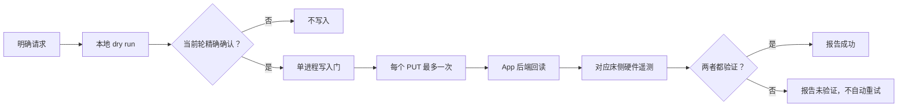

<div align="center">

# 🌙 Manage Eight Sleep

**安全、可验证、可分享的 Codex / Hermes Eight Sleep Skill**


[](LICENSE)

[English](README.md) · [简体中文](README.zh-CN.md) · [安全政策](SECURITY.md) · [隐私说明](PRIVACY.md)

</div>

> [!IMPORTANT]
> 本项目是非官方社区项目，与 Eight Sleep, Inc. 无隶属、授权或支持关系。项目使用未公开的移动 App API，接口可能随时变化。仅可使用由运行者本人控制的账号，以及本人拥有或获授权操作的设备。获得设备操作授权不代表可以共享他人的密码、token 或设置文件。

Manage Eight Sleep 是一个**只读优先**的 Skill 项目，用于睡眠摘要和严格受控的 Pod 温控。项目内置 CLI 没有第三方运行时 npm 依赖；首次认证由一个固定版本的独立社区工具完成。

> [!NOTE]
> 本项目验证的是 **App 后端回读**，不是手机屏幕。`app_ui_observed` 始终为 `false`。如果 App 后端和硬件验证都通过，但手机界面仍显示旧状态，请刷新 App，不要为了刷新界面重复写入。

## 设计目标

本项目针对 Agent 实际调用 Eight Sleep 时出现过的故障模式进行防护，但不承诺能让私有 API 永久稳定。

| 故障模式 | 本项目的处理 |
|---|---|
| API 接受写入，但状态没有真正应用 | 要求新的 App 后端回读和对应床侧的硬件遥测同时成立 |
| App 状态与硬件遥测不一致 | 两类证据独立报告；两者都匹配才算成功 |
| 把相对档位说成摄氏度 | 只使用 `-10` 到 `+10` 的 App 相对档位，绝不标注 °C 或 °F |
| 把 App 档位 `0` 当作关闭 | `0` 仅表示中性智能温控；关闭使用独立的严格验证 |
| 超时后重复写入 | PUT 不自动重试；结果不明时只做只读复核 |
| Hermes 同时加载多个旧控制路径 | 安装前检测冲突，并把旧 skill 归档到不会被扫描的目录 |
| 参数拼错或没有填写时长 | 在读取凭据或联网前失败；写入时长没有默认值 |
| Trends 同时发送互斥参数 | 每次只发送 `main` 或 `all` 中的一个 |



## 验证边界

| 证据 | 能支持什么 | 不能证明什么 |
|---|---|---|
| `app_state_verified` | 私有移动端后端的最新回读与请求的状态、目标和定时覆盖匹配 | 手机屏幕已经刷新或被观察 |
| `hardware_verified` | 非零设定时，对应床侧的实际/当前遥测方向匹配、任何已返回的目标值精确匹配，且活动标记不能明确为 false；关闭或归零时，该床侧返回已验证的实际零值，或同时返回精确目标 `0` 和 inactive 状态 | 实际体感、表面温度或医疗效果 |
| `app_ui_observed` | 始终为 `false` | 本项目不会检查手机 UI |

只有以下字段同时成立，才可以报告完整成功：

```text
ok = true
verification.app_state_verified = true
verification.hardware_verified = true
```

`accepted_by_api` 仅作为 `app_state_verified` 的兼容别名保留；它不表示“PUT 返回了 200”。

## 功能与边界

| 支持 | 不支持 |
|---|---|
| 主睡眠趋势、评分、阶段和效率 | 诊断、治疗、紧急监控或临床决策 |
| 可选包含小睡和次要会话 | 默认导出原始健康数据 |
| 当前 Pod 温控状态 | 手机屏幕自动化 |
| 有时长上限的临时 App 档位覆盖 | 永久覆盖或日程修改 |
| 严格关闭和只读关闭复核 | 闹钟、底座、离家模式或账号修改 |
| Hermes 冲突和配置风险审计 | 多 Pod 选择 |

## 快速开始

### 环境要求

- macOS 或 Linux
- Node.js 22 或更高版本；CI 覆盖 Node.js 22、24 和 26
- 由运行此 skill 的使用者本人控制的 Eight Sleep 账号
- Codex、Hermes，或两者同时使用

### 1. 安装

```bash
git clone https://github.com/w2478328197-arch/eight-sleep-reliable-skill.git
cd eight-sleep-reliable-skill
chmod +x install.sh
```

选择一个安装目标：

```bash
./install.sh codex
./install.sh hermes
./install.sh both
```

默认安装位置：

| Host | 目录 |
|---|---|
| Codex | `${CODEX_HOME:-$HOME/.codex}/skills/manage-eight-sleep` |
| Hermes | `${HERMES_HOME:-$HOME/.hermes}/skills/manage-eight-sleep` |

默认不会覆盖已有安装。只有在检查新旧内容后，才使用 `--force`：

```bash
./install.sh codex --force
./install.sh both --force
```

如果 Hermes 检测到已知的旧 Eight Sleep skill，安装会停止。检查路径后，让安装器把旧 skill 移动到 skill 发现目录之外、带时间戳且可恢复的 `${HERMES_HOME:-$HOME/.hermes}/backups/manage-eight-sleep/`：

```bash
./install.sh hermes --backup-conflicts
```

安装器不会修改 `~/.hermes/config.yaml`。安装完成后请重启 Host 或开始一个新会话。

### 2. 在本地认证

每位使用者都必须在自己的电脑上，让[固定版本的第三方工具](https://www.npmjs.com/package/eight-sleep-mcp-unofficial/v/0.2.5)使用由本人控制的账号生成 token：

```bash
npx -y eight-sleep-mcp-unofficial@0.2.5 setup \
  --client generic --privacy-mode summary

chmod 600 ~/.eight-sleep-mcp/config.json \
  ~/.eight-sleep-mcp/tokens.json
```

当该工具询问是否启用它自己的写入工具时，请选择 **No**。`--client generic` 可以避免它修改 Codex/Hermes 配置或安装另一个 Hermes skill。使用前请检查[固定版本包页面](https://www.npmjs.com/package/eight-sleep-mcp-unofficial/v/0.2.5)及其[源代码仓库](https://github.com/davidmosiah/eight-sleep-mcp)。

第三方设置工具会独立处理账号凭据，并可能把凭据保存在它自己的本地配置中。本项目内置 CLI 默认使用 `~/.eight-sleep-mcp/tokens.json` 认证；也可以通过 `EIGHT_SLEEP_TOKEN_PATH` 指定其他 token 文件。如果 `EIGHT_SLEEP_ACCESS_TOKEN` 或 `EIGHT_SLEEP_USER_ID` 任意一个存在，就必须同时提供两者，而且这组环境变量的优先级高于任何 token 文件。认证过程不会使用邮箱或密码，CLI 也不会修改 token 文件。可选的 Hermes 审计只在本地扫描 skill 路径，以及 `${HERMES_HOME:-$HOME/.hermes}/config.yaml` 和 `${HERMES_HOME:-$HOME/.hermes}/.env` 中的风险标记；它不会返回配置值，也不会持久化或发送扫描内容。

请把两个本地文件都视为密钥。不要把配置、token、原始 API 返回或真实睡眠数据粘贴到聊天、Issue、截图或公开日志中。

### 3. 检查是否就绪

请为当前终端选择一个 skill 路径。下面的写法会兼容自定义 `CODEX_HOME` 或 `HERMES_HOME`；如果安装到了其他位置，请让 `SKILL_DIR` 指向实际 skill 目录。

```bash
# Codex（默认）
SKILL_DIR="${CODEX_HOME:-$HOME/.codex}/skills/manage-eight-sleep"

# Hermes：改用下面这一行
# SKILL_DIR="${HERMES_HOME:-$HOME/.hermes}/skills/manage-eight-sleep"
```

```bash
# Codex：离线检查凭据与文件权限
node "$SKILL_DIR/scripts/eight-sleep.mjs" \
  doctor --json

# 可选的只读 API 连通性检查
node "$SKILL_DIR/scripts/eight-sleep.mjs" \
  doctor --check-api --json

# Hermes：同时检查旧控制路径和配置风险
node "$SKILL_DIR/scripts/eight-sleep.mjs" \
  doctor --check-hermes --json
```

只有顶层结果同时包含 `ok: true` 和 `credentials.ready: true`，才可把安装视为就绪。在 macOS 或 Linux 上使用 token 文件时，`credentials.secure_permissions` 也必须为 `true`；如果组内用户或其他本地用户可以读取该文件，`doctor` 会按失败处理。

请根据认证来源恢复过期认证：

- **默认 token 文件：** 用下面的命令刷新 `~/.eight-sleep-mcp/tokens.json`：

```bash
npx -y eight-sleep-mcp-unofficial@0.2.5 login
```

- **自定义 token 文件：** 把同一路径传给固定版本的登录工具，避免它只刷新默认文件：

```bash
EIGHT_SLEEP_TOKEN_PATH="/absolute/path/to/tokens.json" \
  npx -y eight-sleep-mcp-unofficial@0.2.5 login
```

- **单进程环境变量对：** 通过可信的秘密管理器同时替换 `EIGHT_SLEEP_ACCESS_TOKEN` 和 `EIGHT_SLEEP_USER_ID`，或者同时取消两者以回到 token 文件认证。登录命令无法刷新外部注入的变量对。

完成任何恢复后，都要再次运行 `doctor --json`。

## 迁移已有 Hermes 环境

旧 Hermes 环境可能同时加载 MCP skill、直接 API skill 和持久写入开关，导致重复写入、绕过确认或过早报告成功。

1. 使用 `./install.sh hermes --backup-conflicts` 把已知冲突备份到 skill 目录之外。
2. 运行 `doctor --check-hermes --json`。
3. 如果审计报告旧 MCP block，请先备份 `~/.hermes/config.yaml`，再手动禁用或删除整个旧 Eight Sleep block。
4. 从 `config.yaml` 和 `$HERMES_HOME/.env` 中删除持久化的 `EIGHT_SLEEP_ALLOW_MUTATIONS=true`，以及持久化的 Eight Sleep 邮箱、密码、access token 或 user ID 键。删除旧凭据前，先用只读的 `doctor --check-api --json` 确认 token 文件认证成功。
5. 重启 Hermes，然后再次运行 `doctor --check-hermes --json`。
6. 在任何真实温控写入前，必须看到最新审计返回：

```json
{
  "hermes": {
    "ready_for_single_skill_use": true
  }
}
```

> [!CAUTION]
> 审计只在本机扫描 `config.yaml`、`$HERMES_HOME/.env` 和 skill 路径。它只返回布尔值、相对路径和建议，不会返回、持久化或发送配置值。不要把配置值复制到命令、Issue 或聊天中。

## 常用只读命令

```bash
# 当前本地日历日及之前 6 天的主睡眠
node "$SKILL_DIR/scripts/eight-sleep.mjs" \
  trends --days 7 --timezone Asia/Shanghai

# 包含小睡和次要会话
node "$SKILL_DIR/scripts/eight-sleep.mjs" \
  trends --days 7 --timezone Asia/Shanghai --session-mode all

# 当前温控状态
node "$SKILL_DIR/scripts/eight-sleep.mjs" \
  temperature get --json

# 不写入，只验证目标、预计剩余时长和硬件遥测
node "$SKILL_DIR/scripts/eight-sleep.mjs" \
  temperature verify --app-level -2 --duration-seconds 3600 --json

# 严格只读验证温控是否完全关闭
node "$SKILL_DIR/scripts/eight-sleep.mjs" \
  temperature verify --off --json
```

`--to` 是不包含在结果内的日期结束边界。默认 `main` 只分析主睡眠；只有明确需要小睡或所有会话时才使用 `all`。

## 温控写入安全规则

Eight Sleep App 档位是 `-10` 到 `+10` 的相对舒适档位，不是摄氏或华氏温度。App 档位 `0` 是中性智能温控，不是关闭。

安全模型包含一个 Agent 策略门和两个 CLI 强制门：

1. **Agent 策略：** 对 `temperature set`，用户必须在当前对话轮次明确要求精确 App 档位和时长；对 `temperature off`，用户必须在当前轮明确授权清除手动温控覆盖。旧授权和推测偏好都不算授权。
2. **CLI 门：** 只为当前进程设置 `EIGHT_SLEEP_ALLOW_MUTATIONS=true`。
3. **CLI 门：** 命令同时包含 `--apply` 和 dry run 返回的精确 `--confirm-write` 值。

确认字符串是计划的安全校验值，不是秘密。对 `temperature set`，档位和时长都必须填写；时长必须在 60–14,400 秒之间。

```bash
# 1. 只生成本地计划，不改变 Pod
node "$SKILL_DIR/scripts/eight-sleep.mjs" \
  temperature set --app-level -2 --duration-seconds 3600 --json

# 2. 仅在当前轮确认完全相同的计划后执行
EIGHT_SLEEP_ALLOW_MUTATIONS=true \
node "$SKILL_DIR/scripts/eight-sleep.mjs" \
  temperature set --app-level -2 --duration-seconds 3600 \
  --apply --confirm-write=temperature:set:-2:3600 --json
```

关闭温控遵循相同流程：

```bash
# Dry run
node "$SKILL_DIR/scripts/eight-sleep.mjs" \
  temperature off --json

# 仅在当前轮获得明确授权后执行
EIGHT_SLEEP_ALLOW_MUTATIONS=true \
node "$SKILL_DIR/scripts/eight-sleep.mjs" \
  temperature off --apply --confirm-write=temperature:off --json
```

关闭时，App 后端必须报告 `off`，当前档位必须为 `0`，并且定时覆盖必须已清除。对应 Pod 床侧还必须返回已验证的实际/当前零值，或者同时返回精确目标 `0` 和明确的 inactive 状态。在后一种情况下，滞后的非零 heating-level 字段不会推翻更新的 inactive 加零目标证据。如果 App 状态中只残留一个大于零的时长占位字段，CLI 仍会保守地把它视为未清除的覆盖；即使硬件已经停止，整体也报告未验证。此时只做只读复核，绝不能沿用旧授权重写。

PUT 请求不会自动重试。超时或结果不明后，CLI 只进行只读验证。如果仍未验证，skill 策略禁止在旧授权下手动重复写入。

## 隐私与限制

- 睡眠、心率、HRV、呼吸、温度和在床数据都属于敏感信息。
- 默认输出摘要；`--json` 仍然是摘要结构，请保留在本地并在分享前检查。
- 本项目不会返回同床用户的身份信息或测量数据。
- 底层账号 token 不保证是只读或限权 token；只读优先来自 skill 策略和命令设计。
- 私有 API 可能改变字段、拒绝请求或撤销认证。
- 这不是医疗设备，不能用于诊断、治疗、急救或临床决策。

完整规则见 [SECURITY.md](SECURITY.md) 和 [PRIVACY.md](PRIVACY.md)。

## 开发与验证

```bash
npm test
npm run validate
```

测试不会连接 Eight Sleep，也不需要真实凭据。CI 覆盖 Node.js 22、24 和 26，并检查安装器、CLI、秘密扫描和关键失败关闭路径。

```text
skills/manage-eight-sleep/
├── SKILL.md
├── agents/openai.yaml
├── references/
│   ├── api-behavior.md
│   └── setup.md
└── scripts/
    ├── eight-sleep-lib.mjs
    └── eight-sleep.mjs
```

## 致谢与许可证

认证设置使用 MIT 许可的社区包 [`eight-sleep-mcp-unofficial@0.2.5`](https://www.npmjs.com/package/eight-sleep-mcp-unofficial/v/0.2.5)；其[源代码仓库位于 GitHub](https://github.com/davidmosiah/eight-sleep-mcp)。它不是本项目的运行时依赖，本仓库也没有复制其源代码。

本项目采用 [MIT License](LICENSE)。
